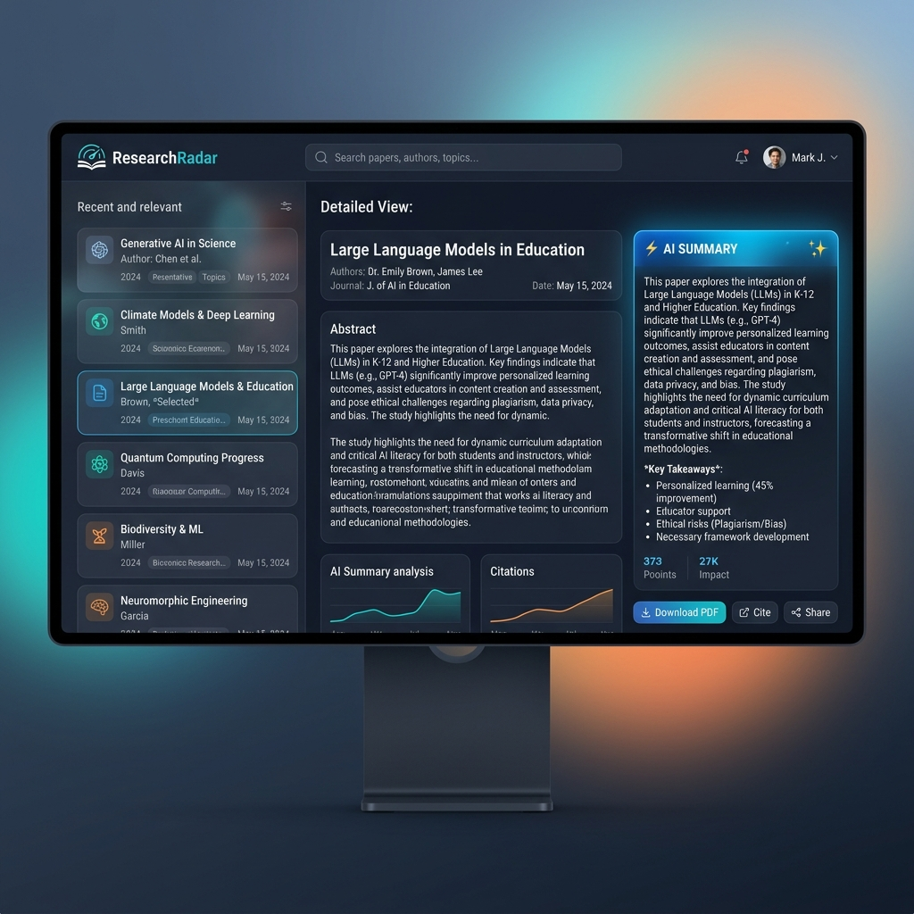

# ResearchRadarFSD



ResearchRadarFSD is a full-stack web application designed to help researchers organize, discover, and summarize academic papers. Built with a modern tech stack, the platform uses AI to automatically generate concise summaries of research papers, accelerating the literature review process.

## 🚀 Features

- **Paper Repository**: Store, manage, and retrieve academic papers.
- **AI Summarization**: Integrates with Google's Gemini AI (`@google/genai`) to automatically read abstracts and generate concise, high-level summaries highlighting core problems, proposed solutions, and key results.
- **Modern UI**: A responsive and interactive frontend built with Vue.js and Vite.
- **RESTful API**: An Express.js backend serving as the interface between the client, database, and AI services.
- **Robust Database**: MongoDB integration for reliable storage of papers and user data.
- **Serverless Ready**: Fully configured for serverless deployment on Vercel.

## 🛠️ Tech Stack

**Frontend:**
- Vue 3 (Composition API)
- Vite (Build Tool)

**Backend:**
- Node.js
- Express.js
- Mongoose (MongoDB Object Modeling)
- Google Gen AI SDK (`@google/genai`) for Gemini API

**Deployment:**
- Vercel (Serverless Functions & Static Hosting)

## 📁 Project Structure

```text
ResearchRadarFSD/
├── Backend_API/
│   ├── Database/          # MongoDB models (User, Paper)
│   ├── routes/            # API endpoints (userRoutes, paperRoutes)
│   ├── aiService.js       # Gemini AI integration for paper summaries
│   ├── server.js          # Express app entry point
│   └── package.json       # Backend dependencies
├── Frontend/
│   ├── src/               # Vue.js components and assets
│   ├── index.html         # Frontend entry point
│   ├── vite.config.js     # Vite configuration
│   └── package.json       # Frontend dependencies
└── vercel.json            # Vercel deployment and routing configuration
```

## ⚙️ Local Development

### Prerequisites
- Node.js (v18+)
- MongoDB Atlas (or local MongoDB)
- Google Gemini API Key

### Backend Setup
1. Navigate to the backend directory:
   ```bash
   cd Backend_API
   ```
2. Install dependencies:
   ```bash
   npm install
   ```
3. Create a `.env` file in the `Backend_API` directory and add your credentials:
   ```env
   PORT=5001
   MONGO_URI=your_mongodb_connection_string
   GEMINI_API_KEY=your_gemini_api_key
   ```
4. Start the backend development server:
   ```bash
   npm run dev
   ```

### Frontend Setup
1. Navigate to the frontend directory:
   ```bash
   cd Frontend
   ```
2. Install dependencies:
   ```bash
   npm install
   ```
3. Start the frontend development server:
   ```bash
   npm run dev
   ```

## ☁️ Deployment

This project is configured for seamless deployment on [Vercel](https://vercel.com).
The `vercel.json` file handles routing, directing `/api/*` traffic to the Express backend and letting the Vue app handle client-side routing.

Make sure to configure the `MONGO_URI` and `GEMINI_API_KEY` Environment Variables in your Vercel Project Settings.